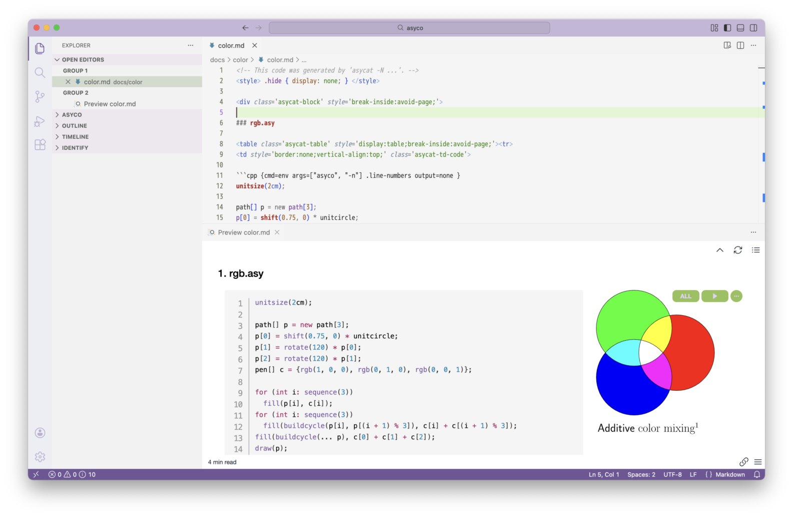
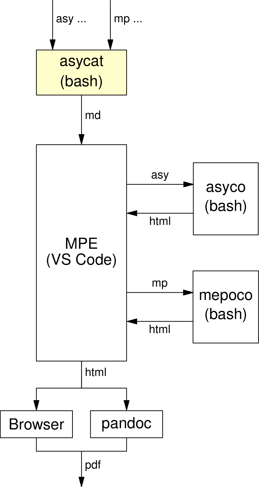

# asycat

<style>code { white-space: pre-wrap !important; } </style>

With `asycat`, you can generate Markdown with code and figures side by side from [Asymptote](https://asymptote.sourceforge.io) or [MetaPost](https://tug.org/metapost.html) files. Embedding the figures uses the [code chunk](https://shd101wyy.github.io/markdown-preview-enhanced/#/code-chunk) feature of [Markdown Preview Enhanced (MPE)](https://shd101wyy.github.io/markdown-preview-enhanced), an extension for [Visual Studio Code (VS Code)](https://code.visualstudio.com).

{width=60% style="display:block;margin:auto;"}

The Markdown can be converted to a PDF file through VS Code and either a browser or [pandoc](https://pandoc.org). `asycat` cannot be called from code chunks and must be executed on the shell command line.

{width=35% style="display:block;margin:auto;"}

## Requirements and installation

See [INSTALL.md](INSTALL.md).

## Usage

### Creating a Markdown file

Run `asycat` on the shell command line with Asymptote or MetaPost files as arguments, while redirecting Markdown output to a file.
In the following example, a Markdown file `output.md`, which contains code and figures side by side, is created from files with the `.asy` extension in the current directory.

```console
$ asycat *.asy > output.md
```

### Running code chunks in the Markdown file

Open the Markdown file in VS Code. Edit the file as needed, then save it. Preview the file with `Open Preview to the Side`. Run code chunks with `Run Code Chunk` ( <kbd>▶︎</kbd> button) or `Run All Code Chunks` ( <kbd>ALL</kbd> button).

### Creating a PDF file

Choose `Open in Browser` from the shortcut (contextual) menu in the preview. Create a PDF file by printing in the browser. Printing on large paper such as A3 is recommended. You can also choose `Export > HTML` from the shortcut menu to create an HTML file that can then be converted to a PDF file with the `pandoc` command.

## Options

`-B`
: Add a page break after each file for printing.

`-N`
: Show line numbers. This option is not compatible with `-W`, which will be canceled.

`-P {N|S|E|W|F}`
: Set the position of figures relative to code. You can use the following values: `N` North, `S` South, `E` East, and `W` West. You can also use `F` for no code and figures only. The default value is `E`.

`-W`
: Wrap code. This option is not compatible with `-N`, which will be canceled.

`--fig-width=WIDTH`
: Set the width of figures to *`WIDTH`* in horizontal layout (`-P E` or `-P W`). The default value is `30%`.

`--fixed-layout`
: Set the `table-layout` to `fixed` in horizontal layout (`-P E` or `-P W`).

`--heading-level=LEVEL`
: Set the level of headings to the absolute value of *`LEVEL`*. Each file path is used as a heading. Setting a negative value to *`LEVEL`* removes directories form the path, and `0` turns off headings. The default value is `3`.

`--id-prefix=PREFIX`
: Use the prefix *`PREFIX`* and a serial number for the `id` of a code chunk. This option is valid only when `-P W` is specified. The default value is `fig-`.

`--lang-asy-as=LANG`
: Use the language *`LANG`* for the syntax highlighting of Asymptote files (`*.asy`). The default value is `cpp`.

`--lang-mp-as=LANG`
: Use the language *`LANG`* for the syntax highlighting of MetaPost files (`*.mp`). The default value is `metafont`.

`--no-alt`
: Do not set filenames as alternative text for figures.

`--no-cd`
: Do not change directory for each file.

`--`
: Option-end delimiter. Arguments after `--` are treated as filenames or directory names.

Additionally, the following options are available if specified as the first argument: `-h`, `--help` (show usage and exit) and `--version` (show version information and exit).

Other options are passed to `asyco` or `mepoco`. For this behavior, short options cannot be combined (use `-N -B` instead of `-NB`, for example). Also, a short option and its argument must be separated by spaces (use `-P E` instead of `-PE`, for example).

## Environment variables

You can set environment variables in your shell initialization file, such as `~/.bash_profile`. You can also set the variables on the command line.

`ASYCAT_ASY_OPTS`
: Set default options for `asyco`.

`ASYCAT_MP_OPTS`
: Set default options for `mepoco`.

You cannot set the options of `asycat` with these variables.

## Classes

Settings of CSS (Cascading Style Sheets) properties by classes are effective throughout a document. Later settings override earlier ones.

`asycat-block`
: Used for the `<div>` block per file.

The following classes are valid only in horizontal layout (`-P E`  or `-P W`).

`asycat-table`
: Used for tables which contain code and a figure.

`asycat-td-code`
: Used for code cells in the table.

`asycat-td-fig`
: Used for figure cells in the table.

## Examples

### Specifying multiple directories

Directories must be specified after the option-end delimiter `--` or as the last argument. In the following example, the Markdown document `output.md` is created from files with the `.asy` or `.mp` extension in the `tests` and `docs/color` directories.

```console
$ asycat -- tests docs/color > output.md
```

### Setting execution directory

If you specify files that are not in the current directory, `asyco` or `mepoco` will be executed after changing to each directory where the file is located.

```console
$ asycat tests/test.asy > output.md
```

The code chunk options are as follows. The option `--cd=tests` for `asyco` is added to `args`.

````markdown
```cpp {cmd=env args=["asyco", "-A", "N", "--cd=tests", "--alt=test"] output=html .hide continue}
````

If you want to run `asyco` in the directory where the Markdown document is located, specify the `--no-cd` option.

```console
$ asycat --no-cd tests/test.asy > output.md
```

The code chunk options are as follows. The `--cd` option is not added to `args`.

````markdown
```cpp {cmd=env args=["asyco", "-A", "N", "--alt=test"] output=html .hide continue}
````

### Separate options for Asymptote and MeatPost

You can specify options for `asyco` and `mepoco` separately using environment variables.

```console
$ ASYCAT_ASY_OPTS="--img-zoom=2x" ASYCAT_MP_OPTS="--img-zoom=2" asycat -f png *.asy *.mp > output.md
```

### Merging multiple Markdown documents

If you set figures to appear to the left of code (`-P W`), a code chunk uses `id` to reference another code chunk.

```console
$ asycat -P W rgb.asy > rgb.md
$ asycat -P W cmyk.asy > cmyk.md
```

The code chunks with `id=fig-1` are generated in both `rgb.md` and `cmyk.md`.

````markdown
```cpp {cmd=env args=["asyco", "-n"]  output=none id=fig-1}
````

You can use the `--id-prefix` option to avoid the collision of identifiers when merging or importing multiple Markdown documents generated by `asycat`.

```console
$ asycat -P W --id-prefix=fig-c- cmyk.asy > cmyk.md
```

The code chunk with `id=fig-c-1` is generated in `cmyk.md`.

````markdown
```cpp {cmd=env args=["asyco", "-n"]  output=none id=fig-c-1}
````

## Copyright and license

(c) 2025-2026 aelata

This software is licensed under the MIT No attribution (MIT-0) License. However, this License does not apply to any files with the .html or .js extension.
[https://opensource.org/license/mit-0](https://opensource.org/license/mit-0)

---
